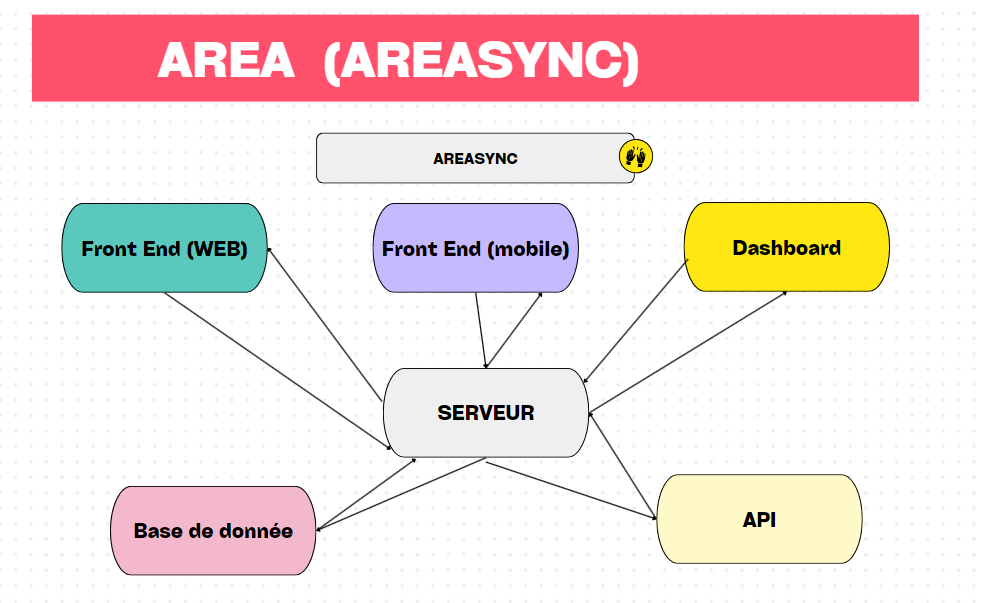
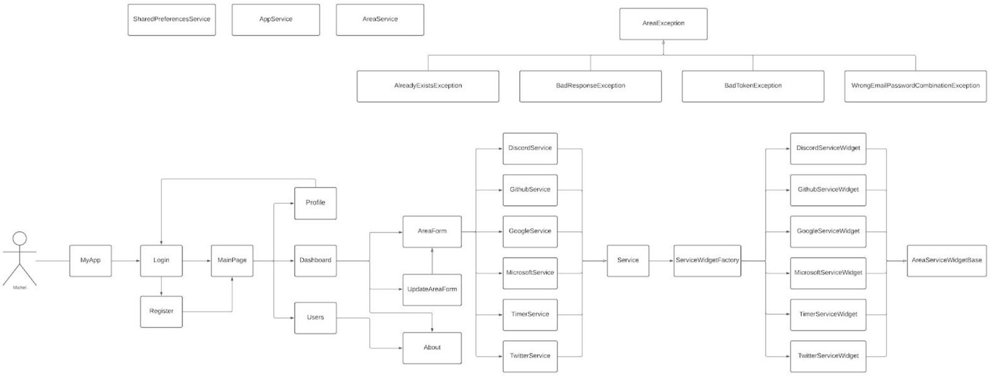

## <u> Overall Project Architecture </u>

As mentioned above, the project is divided into three parts. We have:

* ⁠the Server part
* the client web
* the mobile client

The Web/Mobile client is only responsible for displaying screens and transmitting user requests to the application server.

Brief explanation of the diagrams below:

First we have a Server which is linked to a database. This same Server contains the implementation of certain services such as (Gitlab, Github, etc.). When we take a service it contains a certain number of actions and reactions.

The connection to a service is done from the server and then the token is retrieved.

The client (Web/Mobile) makes route tracking requests in order to get a given response.

The database contains different information about the customer (Web/Mobile).

We have a Cron tasks which checks the actions on the database.

   

<!--  --> 