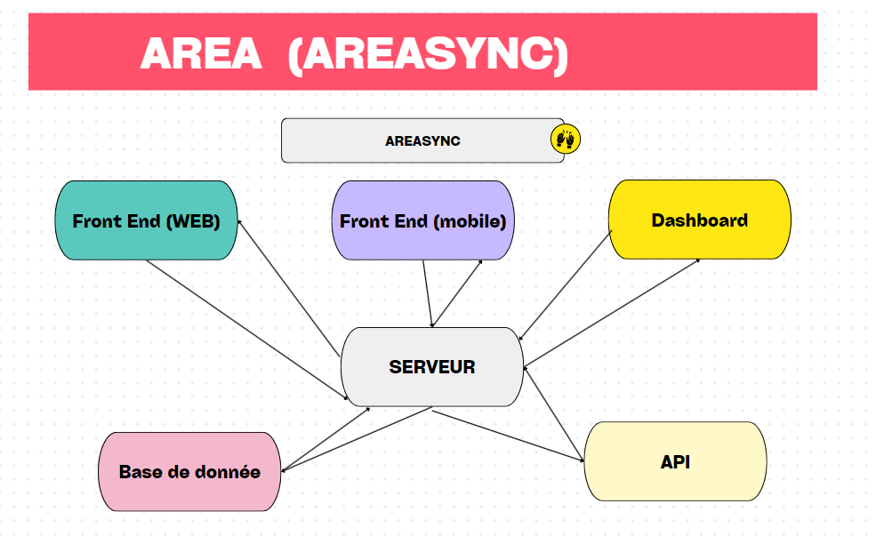
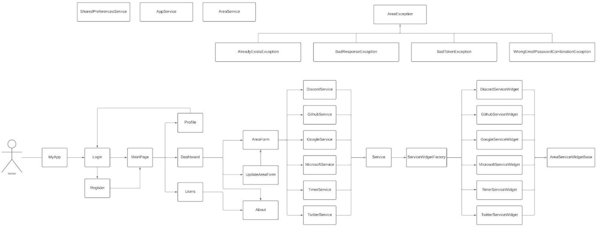

# AREA

## Overview

The project aims to develop a comprehensive application for interconnecting various digital services such as Outlook 365, Yammer, OneDrive, Twitter, etc., enabling users to create and manage customized workflows. The application will be primarily accessed through web and mobile clients, both exposing their functionalities through a REST API provided by the central application server.

## Functionalities

### User Management Module

Users will register on the application to obtain an account, and upon registration confirmation, they will be able to subscribe to different services. The user management module includes:

- User registration via an online form with email validation.
- User authentication using a username/password combination or OAuth2 (e.g., Yammer, Twitter, Facebook).
- Administration section for managing site users.

### Service Subscription

Users can subscribe to various services such as Spotify, GitHub, Google Calendar, Notion, Tally, Gmail, and Discord. Subscription involves OAuth2 authentication and linking third-party accounts to the system user.

### AREA and REAction

Users can compose AREA by interconnecting an Action to a pre-configured REAction. The application triggers AREA automatically based on predefined triggers.

### Mobile and Web Clients

The project includes the development of mobile clients for Android and Windows Mobile, responsible for displaying screens and forwarding user requests. The web client is designed for web browsers and performs similar functions.

## Application Server

The application server hosts the core business logic and exposes services through a REST API. No business model processing occurs on the client side; it only serves as a user interface and redirects requests to the application server.

## Docker Compose

The project utilizes Docker Compose for containerization. The `docker-compose.yml` file defines three services:

1. **Server Service:** Launches the application server on port 8080.
2. **Client Mobile Service:** Builds the mobile client, sharing a common volume with the web client.
3. **Client Web Service:** Launches the web client on port 8081.

## Documentation

The project documentation includes a README.md file written in markdown format. It provides clear and simple instructions for setting up the project, API details, and design schemes (e.g., class diagram, sequence diagram).

The primary goal is to develop a modular, scalable, and well-documented system that facilitates understanding, communication, and collaboration among team members and supports the onboarding of new developers.


## Table of Contents

- [User Management Module](#user-management-module)
- [Subscription to Services](#subscription-to-services)
- [AREA and REAction](#area-and-reaction)
- [Mobile Client and Web Client](#mobile-client-and-web-client)
- [Docker Compose](#docker-compose)
- [Documentation](#documentation)

## User Management Module

### 1. User Registration

- **Description:** Create an online registration form for users to sign up with email. Include validation on the client side and send a request to the server for validation.
- **Tasks:**
  - Design registration form UI
  - Implement client-side validation
  - Implement server-side validation

### 2. User Authentication

- **Description:** Implement user authentication with a username/password combination. The client should transmit the request to the server for processing.
- **Tasks:**
  - Implement login form UI
  - Handle login request on the server
  - Validate user credentials

### 3. OAuth2 Integration

- **Description:** Allow users to authenticate via OAuth2 (e.g., Yammer, Twitter, Facebook). Connect third-party accounts to a system user.
- **Tasks:**
  - Implement OAuth2 authentication on the client
  - Handle successful OAuth2 authentication on the server
  - Link third-party accounts to user profiles

### 4. Administration Section

- **Description:** Create an administration section to manage site users.
- **Tasks:**
  - Design admin panel UI
  - Implement user management functionalities
  - Add user roles and permissions

## Subscription to Services

### 5. Service Subscription

- **Description:** Ask users to subscribe to selected services (Spotify, GitHub, Google Calendar, Notion, Tally, Gmail, Discord) via OAuth2.
- **Tasks:**
  - Display services on the user's profile page
  - Implement OAuth2 authentication for each service
  - Manage service subscriptions on the server

## AREA and REAction

### 6. AREA Configuration

- **Description:** Allow authenticated users to compose AREA by interconnecting an Action to a pre-configured REAction.
- **Tasks:**
  - Design AREA configuration interface
  - Implement client-side AREA composition
  - Send AREA configuration to the server

### 7. Trigger Implementation

- **Description:** Implement triggers to automatically execute AREA based on predefined conditions.
- **Tasks:**
  - Define triggers for each Action
  - Implement trigger functionality on the server
  - Test trigger execution with sample data

## Mobile Client and Web Client

### 8. Mobile Client Development

- **Description:** Develop a mobile client for Android and Windows Mobile responsible for displaying screens and forwarding requests.
- **Tasks:**
  - Set up mobile client project
  - Implement user interface screens
  - Integrate with the server and handle requests

### 9. Web Client Development

- **Description:** Develop a web client responsible for displaying screens and forwarding requests.
- **Tasks:**
  - Set up web client project
  - Implement user interface screens
  - Integrate with the server and handle requests

## Docker Compose

### 10. Docker Compose Configuration

- **Description:** Create a `docker-compose.yml` file to define different services for the application.
- **Tasks:**
  - Define services for the application server, mobile client, and web client
  - Configure services to meet the specified requirements
  - Test integrity of images using `docker-compose up`

## Documentation

### 11. Project Documentation

- **Description:** Provide clear and simple documentation for the project, including architecture and API details.
- **Tasks:**
  - Create a README.md file in markdown format
  - Document the API endpoints and usage
  - Include design schemes (class diagram, sequence diagram)




## Getting Started

### Prerequisites

Before you begin, ensure you have the following tools installed:

- [Docker](https://www.docker.com/get-started)
- [Docker Compose](https://docs.docker.com/compose/install/)

### Installation

1. **Build and start the application using Docker Compose:**

   ```bash
   docker-compose up --build
    ```
2. **Accessing the Application:**

    - The application server will be running at http://localhost:8080.
    - The web client will be accessible at http://localhost:8081.
    - The Android version of the mobile client APK can be obtained from http://localhost:8081/client.apk.

## Contributors

- [Bridge ATINDOKPO](bridge.atindokpo@epitech.eu)
- [Cokou-Ange HOUNNOUVI](cokou-ange.hounnouvi@epitech.eu)
- [Godlyn KIKISSAGBE](godlyn.kikissagbe@epitech.eu)
- [Jean-Luc AHOYO](jean-luc.ahoyo@epitech.eu)
- [Rawdath DEMBA DIALLO](rawdath.demba-diallo@epitech.eu)
- [Yannick KEKE](yannick.keke@epitech.eu)

## License

Not Licensed yet !
